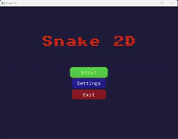

# 🐍 Snake 2D

Snake 2D is a classic snake game built in C++ using SFML. Grow your snake by eating food, avoid poison, and try to reach higher levels while keeping your snake alive! The game features modern UI, sound effects, and interactive popups.

---

## 📌 Table of Contents

- [Features](#-features)
- [Gameplay & Controls](#-gameplay--controls)
- [Screenshots](#-screenshots)
- [Gameplay Video](#-gameplay-video)
- [Project Structure](#-project-structure)
- [Dependencies](#-dependencies)

---

## 🌟 Features

- Classic snake gameplay with grid-based movement
- Normal food to grow and score points
- Poison food that reduces snake length and lives
- Level progression increases snake speed
- Dynamic HUD showing score, level, and lives
- Main menu with animated title and interactive buttons
- Settings popup with music and sound toggles
- Instruction and exit popups
- Game over screen with retry and main menu options
- Smooth audio effects and background music
- Modular design with separate screens, popups, and assets

---

## 🎮 Gameplay & Controls

- **Arrow keys / WASD**: Move the snake
- **Eat food** to grow and earn points
- **Avoid poison food** – costs 1 life
- **Don’t collide with yourself** – collision ends the game

---

## 📷 Screenshots

Main Menu  

In-Game  

## 🎥 Gameplay Video
 

---

## 🗂 Project Structure

| Folder / File                     | Description                                                   |
|----------------------------------|---------------------------------------------------------------|
| `Game.cpp / Game.h`               | Core game loop and initialization                             |
| `screens/MainMenuScreen.cpp/h`    | Main menu with buttons and animated title                     |
| `screens/GameplayScreen.cpp/h`    | Handles gameplay, snake, food, and HUD                        |
| `ui/HUD.cpp/h`                     | Displays score, level, and lives                               |
| `gameobjects/Snake.cpp/h`          | Snake movement, growth, and collision                         |
| `gameobjects/Food.cpp/h`           | Normal and poison food behavior                                |
| `popups/PopupBase.cpp/h`           | Base class for all popups                                      |
| `popups/GameOverPopup.cpp/h`       | Game over popup with retry/main menu                           |
| `popups/ExitPopup.cpp/h`           | Exit confirmation popup                                        |
| `popups/InstructionPopup.cpp/h`    | Instructions popup                                            |
| `popups/SettingsPopup.cpp/h`       | Music/sound toggles and instructions                           |
| `core/AssetManager.cpp/h`          | Manages textures, fonts, and assets                            |
| `core/SoundManager.cpp/h`          | Handles music and sound effects                                 |
| `core/ScreenManager.cpp/h`         | Manages active screen and popups                                |
| `core/GameConfigManager.h`         | Holds game settings and paths                                   |
| `ui/Button.cpp/h`                  | Generic clickable buttons                                       |
| `ui/ToggleButton.cpp/h`            | Toggle buttons for settings                                     |

---

## ⚙ Dependencies

- C++17 or later
- SFML 2.5+ (Graphics, Window, Audio modules)

---
