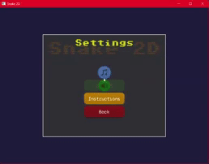

# 🐍 Snake 2D

Snake 2D is a classic snake game built in C++ using SFML. Grow your snake by eating food, avoid poison, and try to reach higher levels while keeping your snake alive! The game features modern UI, sound effects, and interactive popups.

---

## 📌 Table of Contents

- [Features](#-features)
- [Gameplay & Controls](#-gameplay--controls)
- [Screenshots](#-screenshots)
- [Gameplay Video](#-gameplay-video)
- [Project Structure](#-project-structure)
- [Dependencies](#-dependencies)

---

## 🌟 Features

- Classic snake gameplay with grid-based movement
- Normal food to grow and score points
- Poison food that reduces snake length and lives
- Level progression increases snake speed
- Dynamic HUD showing score, level, and lives
- Main menu with animated title and interactive buttons
- Settings popup with music and sound toggles
- Instruction and exit popups
- Game over screen with retry and main menu options
- Smooth audio effects and background music
- Modular design with separate screens, popups, and assets

---

## 🎮 Gameplay & Controls

- **Arrow keys / WASD**: Move the snake
- **Eat food** to grow and earn points
- **Avoid poison food** – costs 1 life
- **Don’t collide with yourself** – collision ends the game

---

## 📷 Screenshots

| Main Menu | Settings Popup | Instruction Popup |
|-----------|----------------|-------------------|
|  |  |  |

| Gameplay Screen | Game Over | Quit Popup |
|-----------|----------------|-------------------|
|  |  |  |

## 🎥 Gameplay Video

Click the image below to watch the gameplay video 👇:
 

---

## 🗂 Project Structure

| Folder / File                     | Description                                                   |
|----------------------------------|---------------------------------------------------------------|
| `Snake2D.cpp`                      | Contains `main()`, entry point of the program                |
| `Game.cpp / Game.h`               | Core game loop and initialization                             |
| `core/AssetManager.cpp/h`          | Loads and manages textures, fonts, and other assets           |
| `core/SoundManager.cpp/h`          | Handles music and sound effects                               |
| `core/ScreenManager.cpp/h`         | Manages current screen and active popups                      |
| `core/GameConfigManager.h`         | Stores game settings, paths, and configuration values        |
| `core/Entity.cpp/h`         | Represents drawable/movable objects (snake segments, etc.)   |
| `screens/MainMenuScreen.cpp/h`    | Main menu with buttons, animated title, and navigation       |
| `screens/GameplayScreen.cpp/h`    | Handles gameplay, snake, food, HUD, and game logic           |
| `popups/PopupBase.cpp/h`           | Base class for all popups                                     |
| `popups/GameOverPopup.cpp/h`       | Game over popup with retry and main menu options             |
| `popups/ExitPopup.cpp/h`           | Exit confirmation popup                                       |
| `popups/InstructionPopup.cpp/h`    | Instructions popup with controls guide                        |
| `popups/SettingsPopup.cpp/h`       | Music/sound toggles and instruction button                   |
| `gameobjects/Snake.cpp/h`          | Snake movement, growth, collision, and rendering             |
| `gameobjects/Food.cpp/h`           | Normal and poison food behavior                               |
| `gameobjects/Grid.cpp/h`           | Draws the game grid and cells                                  |
| `ui/Button.cpp/h`                  | Generic clickable buttons                                     |
| `ui/ToggleButton.cpp/h`            | Toggle buttons for settings (music/effects)                  |
| `ui/HUD.cpp/h`                     | Displays score, level, and lives on screen                   |

---

## ⚙ Dependencies

- C++14 or later
- SFML 2.6+
- Visual Studio 2022
- [nlohmann/json.hpp](Snake2D/src/include/nlohmann/json.hpp) – (JSON library for configuration and data handling)
  
---
